# Karaoke Management Application

A management application for karaoke businesses.

---

## Features

- User authentication (Login, Register, Change password)
- Room management (Add, Edit, Delete, Search rooms)
- Booking management (Reserve, Modify, Cancel bookings)
- Invoice management (Create, Issue invoices, Payment processing)
- Inventory management (Manage goods, Import/Export stock)
- Staff management (Add, Edit, Remove employee records)
- Customer management (Add, Edit, Remove customer profiles)
- Service management (Booking additional services during karaoke session)
- Revenue and customer reporting (optional extension)

---

## System Actors

| Actor          | Description |
|----------------|-------------|
| Manager        | Manages rooms, staff, customers, and business operations |
| Receptionist   | Manages bookings, room availability, and customer invoices |
| Service Staff  | Provides in-session services (drinks, food, etc.) |
| Warehouse Staff| Manages inventory (goods, stock adjustments) |
| Customer       | Books rooms, manages personal account, makes payments |

---

## Main Functionalities

- **Authentication**
  - Login, Logout, Register, Change password
- **Room Management**
  - Add, Edit, Delete, Search rooms
- **Booking Management**
  - Make room reservations, modify and cancel bookings
- **Payment Management**
  - Generate and issue invoices, handle payments
- **Customer Management**
  - Add, Edit, Delete customer profiles, view booking history
- **Staff Management**
  - Manage staff accounts and roles
- **Inventory Management**
  - Add, update, delete product information (goods, services)
- **Service Management**
  - Add or remove service orders during sessions

---

## GUI Screens

| Login | Register | Change password |
|:-----------:|:--------------:|:-----:|
| 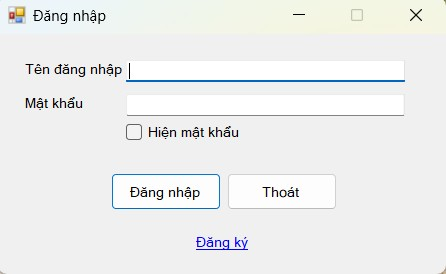 | 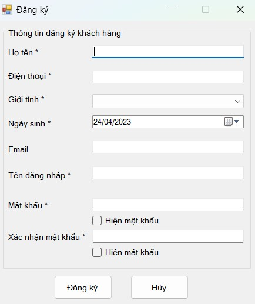 | 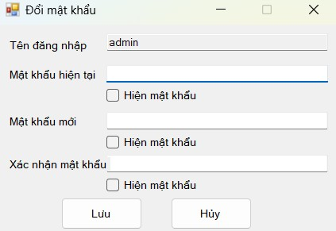 |

| Room management | Staff management | Customer management |
|:-----------:|:--------------:|:-----:|
| 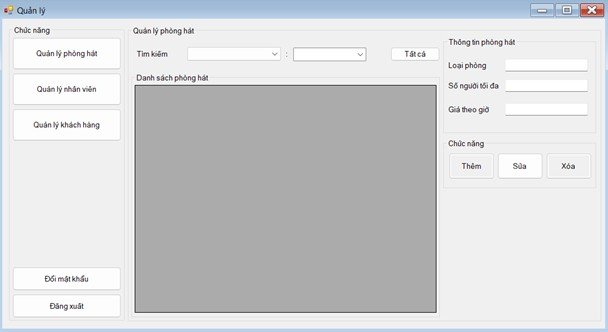 | 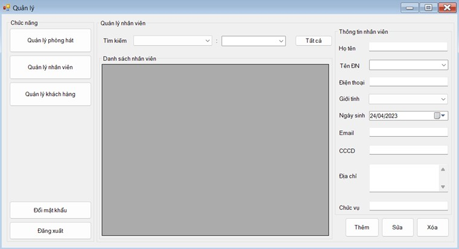 | 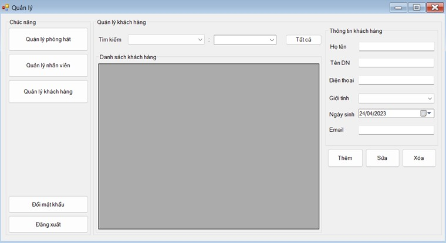 |

| Booking | Payment | Order management |
|:-----------:|:--------------:|:-----:|
| 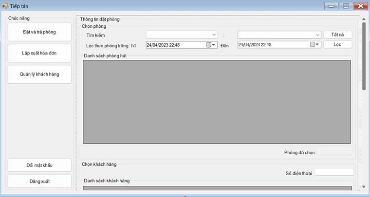 | 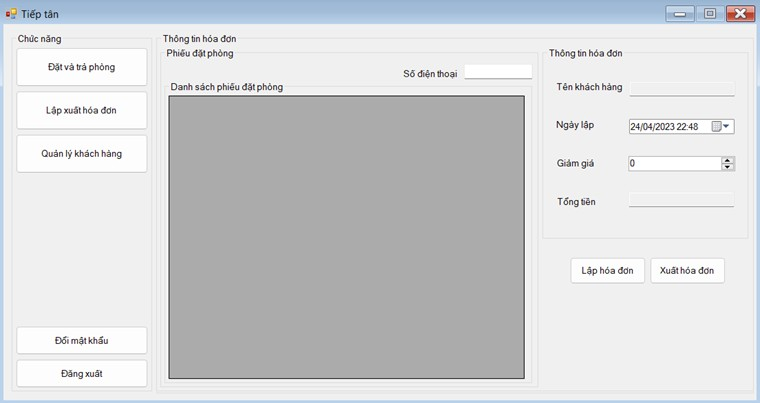 | 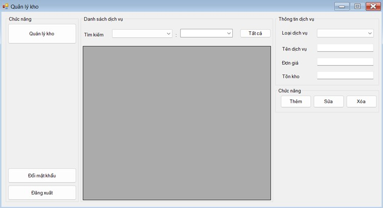 |

| Service | Customer booking | Customer information |
|:-----------:|:--------------:|:-----:|
| 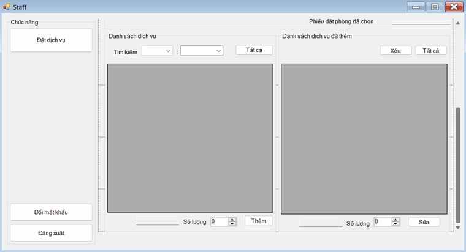 | 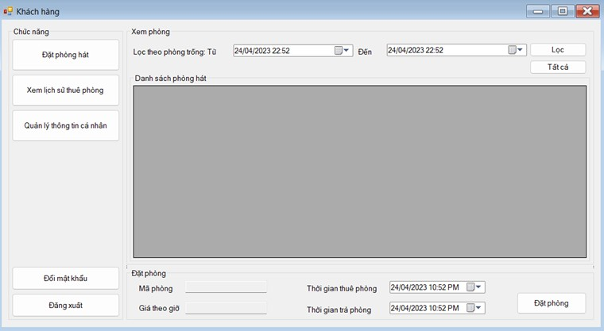 | 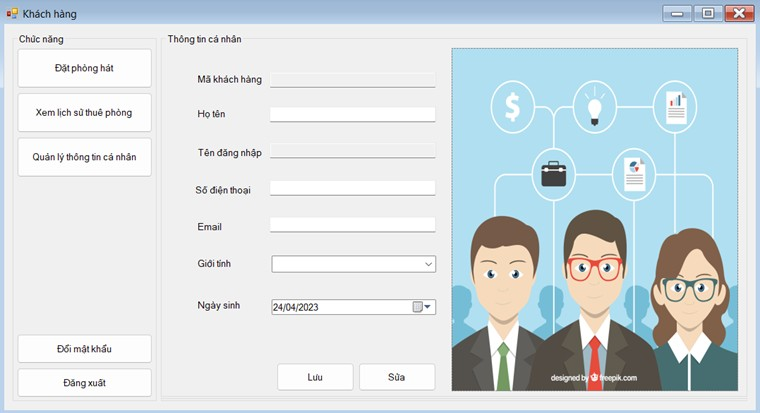 |

---

## Installation & Setup

1. Install **Visual Studio 2019** or newer.
2. Install **SQL Server Management Studio**.
3. Clone the project repository.

```bash
git clone https://github.com/nnhnmhnmnh/QuanLyKaraoke.git
```

4. Open the project in Visual Studio.
5. Configure the connection string to SQL Server in the application settings.
6. Create the necessary database schema using the provided .sql files.
7. Build and run the project.

## Security Requirements

- Passwords are hashed before storing.
- Password minimum length: 8 characters.
- Backup and recovery plans for database storage.
- Secure and intuitive user interface for sensitive operations.

## Non-functional Requirements

- User-friendly and responsive UI
- Data backup support
- Efficient performance, even with high transaction volumes
- Scalable for future integration with other systems